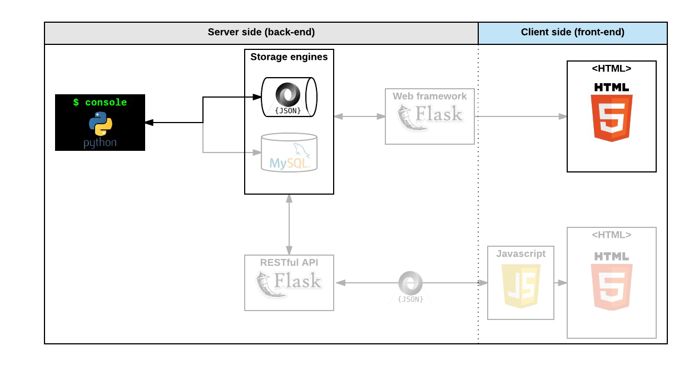
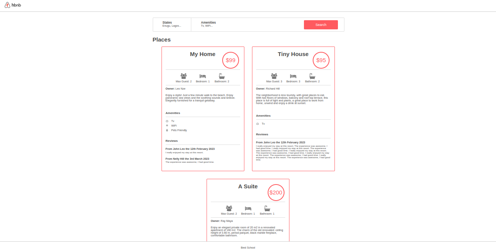
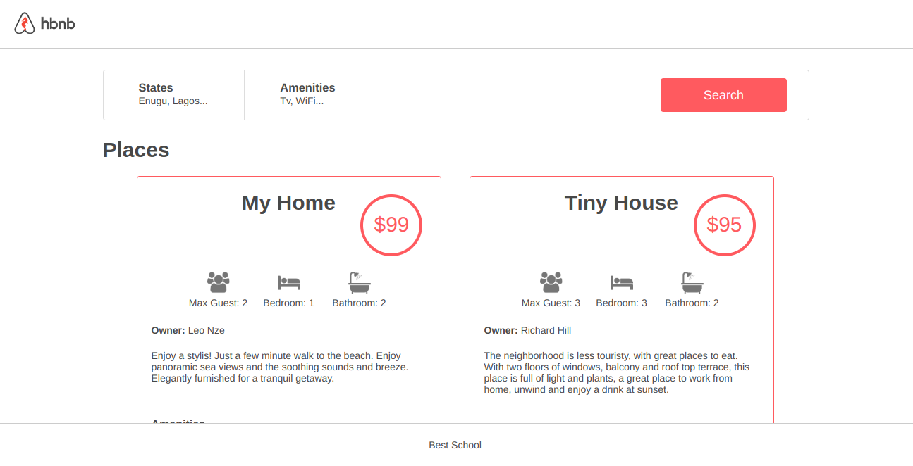
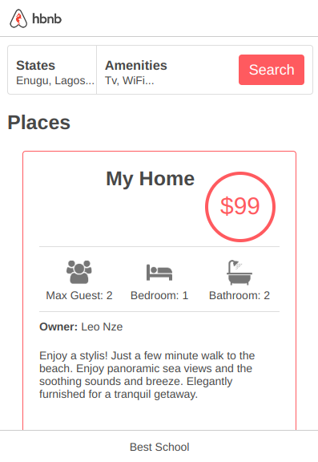

# AirBnB Clone
ALX SWE AirBnB Clone Project


### Authors
- [@leonardnzekwe](https://www.github.com/leonardnzekwe)
- [@rahma-cloud](https://www.github.com/rahma-cloud)

## 1.0: The console
It is a command interpreter used to create, manage, store and persist our objects.

### 1.1: Features:
- creates the data model
- manages (create, update, destroy, etc) objects via a console / command interpreter
- stores and persists objects to a file (JSON file)

### 1.2: Technologies:
- Python

### 1.3: Aim:
The first piece is to manipulate a powerful storage system. This storage engine will give us an abstraction between "My object” and “How they are stored and persisted”. This means: from our console code (the command interpreter itself) and from the front-end and RestAPI we will build later, we won’t have to pay attention (take care) of how our objects are stored.

This abstraction will also allow us to change the type of storage easily without updating all of our codebase.

The console will be a tool to validate this storage engine


### 1.4: Getting Started:
To start the AirBnB clone's console, use the following guide:

- Clone the project repository: `git clone https://github.com/leonardnzekwe/AirBnB_clone`

- Navigate to the project directory: `cd AirBnB_clone`

- Launch the console:
    - Interactively:  `./console.py`
    - Non-interactively: `<input cmd> | ./console.py`

### 1.5: Usage: 
Execute `help` to display a list of available commands. Also execute `help <command>` to show the purpose of the command.

**Classes:** `BaseModel`, `User`, `State`, `City`, `Amenity`, `Place`, `Review`

**Commands Usage:**
- `EOF` - `CTRL + D`
- `quit` - `quit`
- `create` - `create <class_name>`
- `help`:
    - `help`
    - `help <command>`
- `all`:
    - `all`
    - `all <class_name>`
    - `<class_name>.all()`
- `count`:
    - `count`
    - `count <class_name>`
    - `<class_name>.count()`
- `destroy`:
    - `destroy <class_name> <instance_id>`
    - `<class name>.destroy(<id>)`
- `show`:
    - `show <class_name> <instance_id>`
    - `<class name>.show(<id>)`
- `update`:
    - `update <class name> <id> <attribute name> "<attribute value>"`
    - `<class name>.update(<id>, <attribute name>, <attribute value>)`
    - `<class name>.update(<id>, <dictionary representation>)`


### 1.6: Examples:
Interactive mode:
```
$ ./console.py
(hbnb) help

Documented commands (type help <topic>):
========================================
EOF  all  count  create  destroy  help  quit  show  update

(hbnb) 
(hbnb) 
(hbnb) quit
$
```
Non-interactive mode:
```
$ echo "help" | ./console.py
(hbnb)

Documented commands (type help <topic>):
========================================
EOF  help  quit
(hbnb) 
$
$ cat test_help
help
$
$ cat test_help | ./console.py
(hbnb)

Documented commands (type help <topic>):
========================================
EOF  help  quit
(hbnb) 
$
```

## 2.0: Web static
### 2.1: Features
- Static User Interface of the application
- Static templates of each object

### 2.2: Technologies:
- HTML
- CSS



### 2.3: Zoomed View:


### 2.4: Desktop View:


### 2.5: Mobile View:
<div style="display: flex; justify-content: center;">
    
</div>

## 3.0: Data Model

