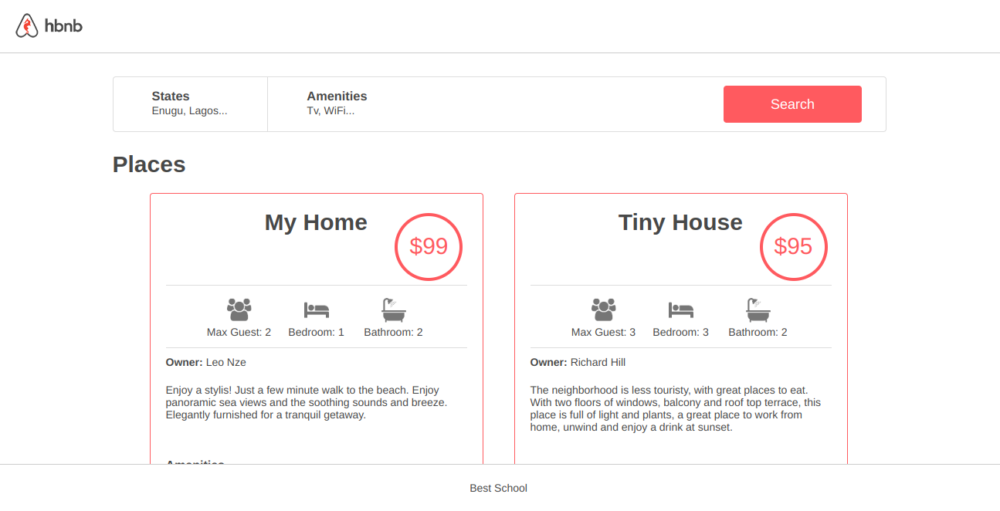
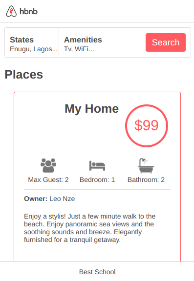

# AirBnB Clone - Web static
Having implemented a command interpreter for managing the AirBnB objects, it’s time to make them alive! Before developing a big and complex web application, we will build the front end step-by-step.

## Features
- Static User Interface of the application
- Static templates of each object
- Populated with Fake Contents

## Technologies:
- HTML
- CSS

## Zoomed View:

## Desktop View:

## Mobile View:

